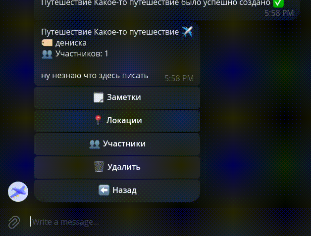
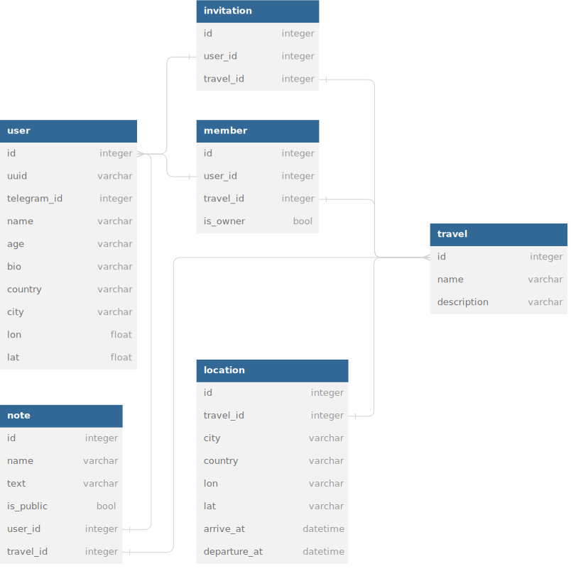

# Travel agent

**бота скрафтил [fadegor05](https://github.com/fadegor05), btw)**

**[Бот проживает по этому адресу](https://t.me/fadegor05_travel_bot)**
## Что это такое?
**Travel Agent** - ваш умный помощник в путешествиях!
Забудьте о долгих часах поиска мест активности, локаций. **Travel Agent** поможет спланировать идеальный тур или поездку всего за пару кликов. Также поможет найти дорогу до промежуточных пунктов в путешествии, а также облегчает путешествия с друзьями. Путешествуйте без забот с **Travel Agent**! ＼(￣▽￣)／


## Как этим пользоваться?

Бот проживает по этому [адресу](https://t.me/fadegor05_travel_bot). Чтобы начать работу с ним необходимо прописать **/start**, после чего он попытается узнать вас получше. Затем вы можете присоединиться к чужому путешествия или найти себе попутчика в соответсвующей вкладке


Или же вы можете создать свое путешествие


А затем пригласить туда кого-нибудь, узнав его уникальный код



## Заметки

Заметки в боте представляют собой сущности с названием, их текстом. Также заметка может быть публичной, видной всем участникам путешествия, или личной, которая видна только своему автору. Заметки могут быть удалены только автором или при удалении путешествия его организатором. (￣ω￣)

## Локации

Локации в боте являются одной из основных идей. Локации содержат в себе город, страну, координаты, время прибытия и время отправления. Город в локациях определяется при помощи библиотеки **geocoder, OpenStreetMap API**. Также по локациям маршрута, и городу откуда нужно будет добираться пользователю, строиться карта, которая отправляется при выборе в меню **Локации**. В локации отображается погода на период времени пребывания там, однако если прогноза погоды на эти даты нет, то выводится текущий прогноз погоды на локации. Еще локации в себе имеют вкладку **Активности и места**, где можно найти множество категорий и мест, таких как достопримечательности, отели, рестораны, пабы, а также информация о них, ссылка на сайт, где можно забронировать столик, номер или купить билеты в музей.


## Стек приложения

Приложение в своей основе использует высокоуровневый динамически типизируемый, а также популярный язык программирования **Python** в связке с ORM **SQLAlchemy**, а также реляционную **Postgres** в качестве СУБД. Вместо стандартного пакетного менеджера **PIP** в проекте для удобства используется **Poetry**, который облегчает многие взаимодействия с модулями python. Стек довольно небольшой, все технологии используются по максимому (* ^ ω ^)

*Стек: Python, Poetry, SQLAlchemy, Postgres*

## Внешние интеграции

**OpenRouteService** - API, использующее бесплатные географические данные, созданные пользователями и собранные совместно, непосредственно из OpenStreetMap. *Использует API Key, однако есть тарифы для некомерческого использования c ограничениями*. В приложении используется для построения маршрута между точками, а точнее генерирует точки на дорогах, по которым уже в боте генерируется карта с маршрутам.

**OpenMeteo** - API погоды с открытым исходным кодом, предлагающий бесплатный доступ для некоммерческого использования. *Ключ API не требуется, есть небольшие ограничения*. В приложении используется для получения погоды на какой-либо период времени, однако если прогноза погоды на данные даты нет, то получется текущий прогноз погоды на локации.

**KudaGo** - API, созданое в России, являющееся интернет-порталом, анонсирующим выставки, концерты, спектакли, фестивали, кинопоказы, различные места, оценки к ним, а также остальную контактную информацию по ним. *Ключ API не требуется*. В приложениии используется для получения достопримечательностей, отелей, ресторанов, пабов и не только.


## Схема базы данных



## Запуск
Старт бота при помощи **docker-compose**
```
docker-compose up -d
```